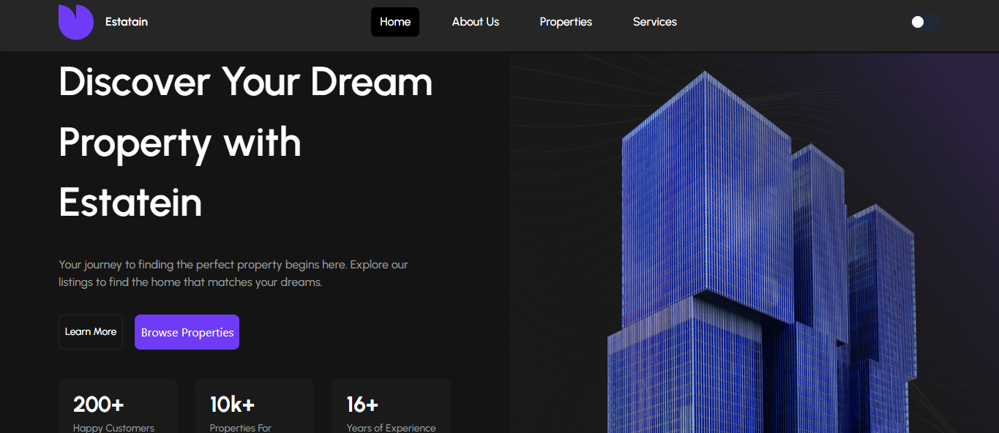
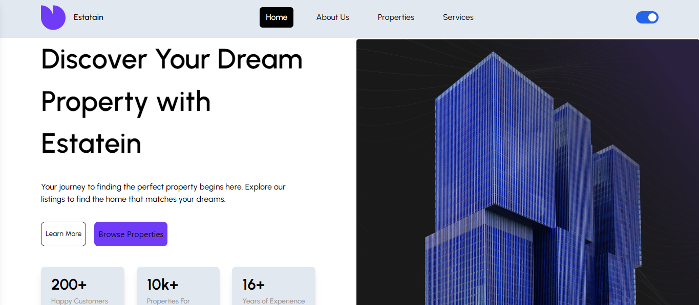
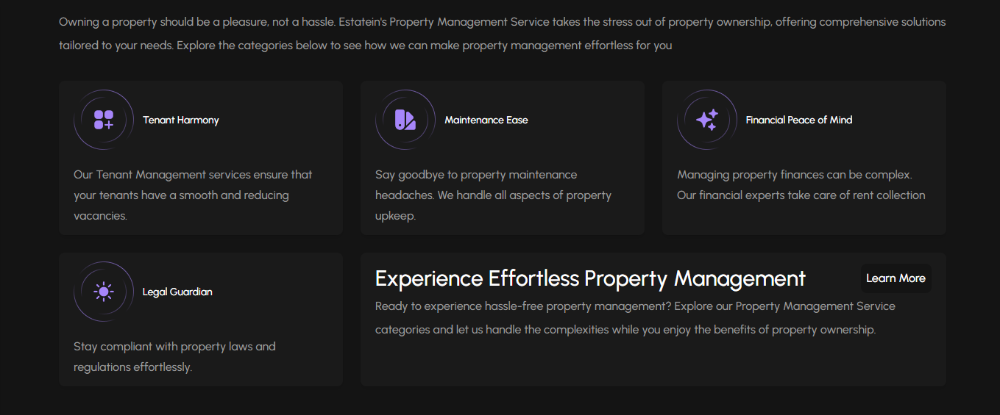

# React + Vite

This template provides a minimal setup to get React working in Vite with HMR and some ESLint rules.

Currently, two official plugins are available:

- [@vitejs/plugin-react](https://github.com/vitejs/vite-plugin-react/blob/main/packages/plugin-react/README.md) uses [Babel](https://babeljs.io/) for Fast Refresh
- [@vitejs/plugin-react-swc](https://github.com/vitejs/vite-plugin-react-swc) uses [SWC](https://swc.rs/) for Fast Refresh

Here’s a detailed README template for your real estate website project on GitHub:

---

# Real Estate Website

This is a responsive real estate website featuring dark mode, property details, testimonials, FAQs, and dedicated pages for About Us, Services, and Properties. The project is designed to showcase real estate listings and provide an engaging experience for users looking for properties.

## Features

- Dark Mode: Allows users to switch between light and dark themes for a personalized browsing experience.
- Property Details: Displays detailed information about individual properties, including images, pricing, and specifications.
- Testimonials: A section for client feedback to build trust with prospective customers.
- FAQ: Frequently Asked Questions section to address common inquiries.
- Pages:
  - About Us: Provides company information and mission statement.
  - Services: Describes the various real estate services offered.
  - Properties: Showcases available properties with filtering options.

## Tech Stack

- Technolgy: React (if applicable), Tailwind CSS
- State Management: React Hooks 
- Additional Libraries: 
  - React Router for navigation
  - React icon for icons

## Usage

- Navigate to the Home page to explore featured properties.
- Visit the About Us and Services pages to learn more about the company.
- Check out the FAQ section for common questions.

### Dark Mode
Users can toggle between light and dark modes using the switch in the header.

## Contributing

Contributions are welcome! To contribute:

1. Fork the repository.
2. Create a new branch (`git checkout -b feature-new-feature`).
3. Commit your changes (`git commit -m 'Add new feature'`).
4. Push to the branch (`git push origin feature-new-feature`).
5. Open a pull request.

